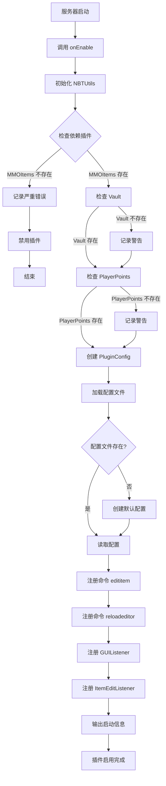
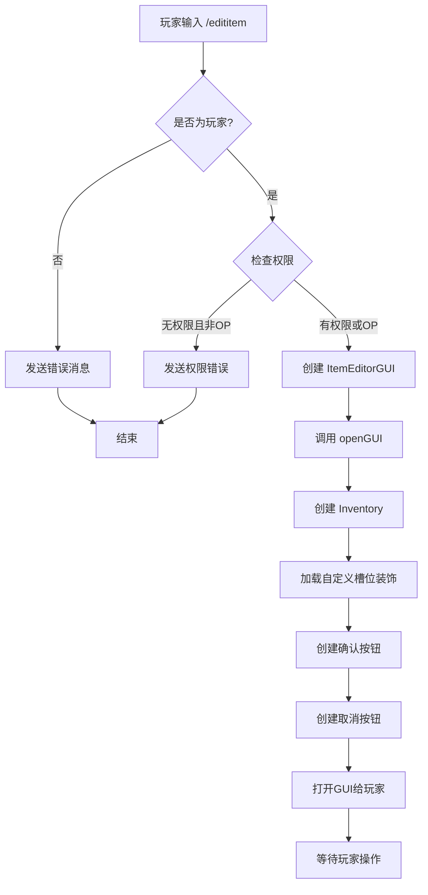
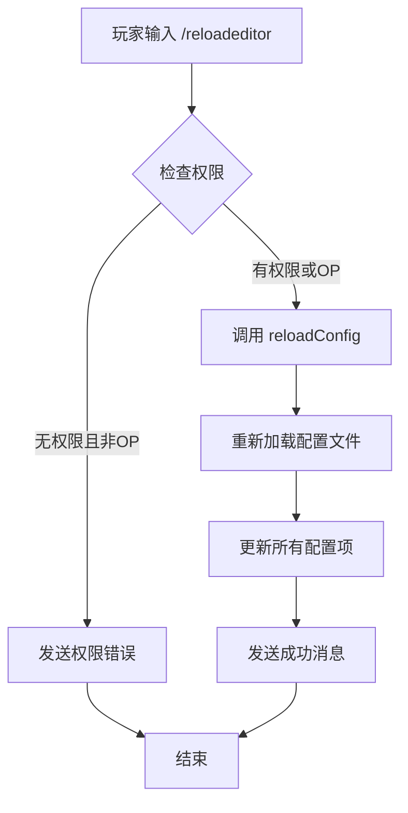
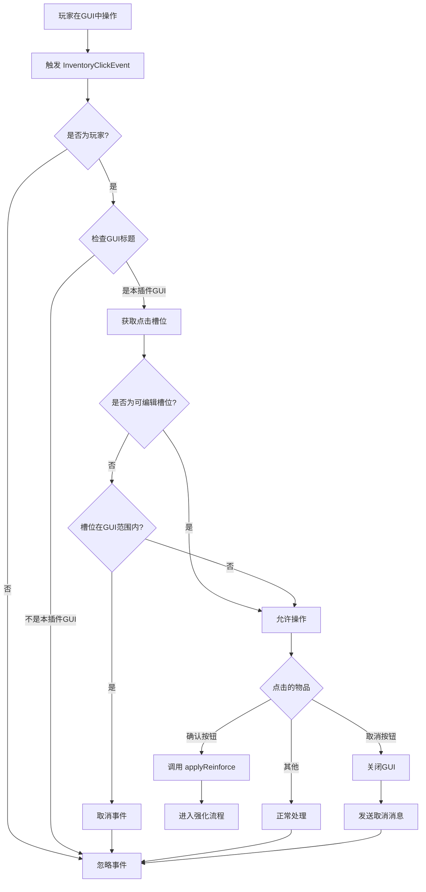
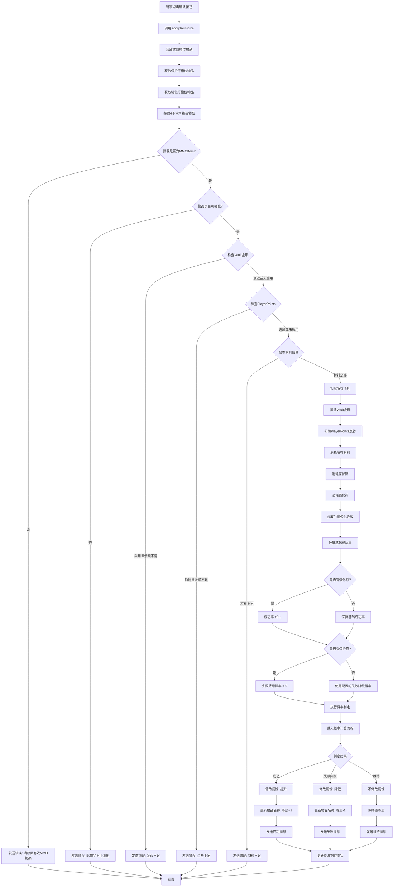
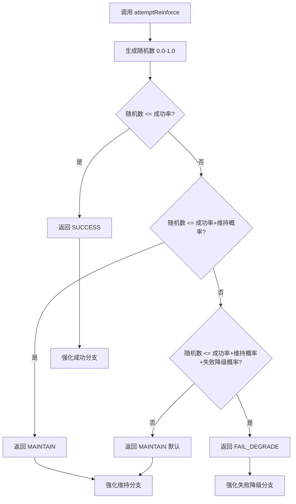
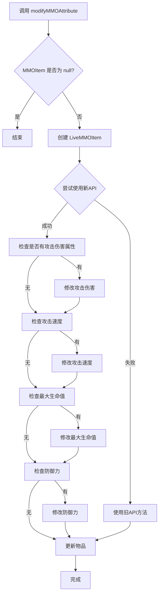
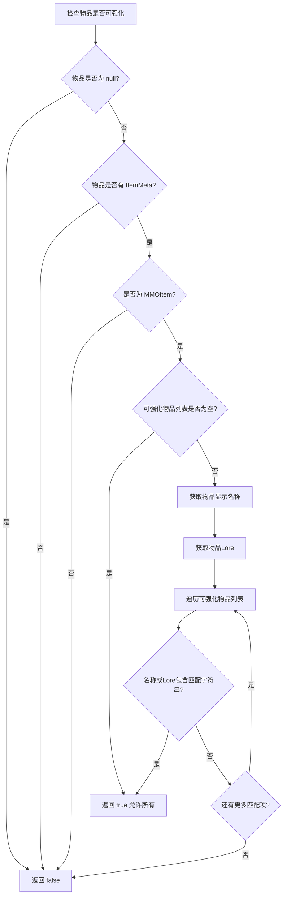
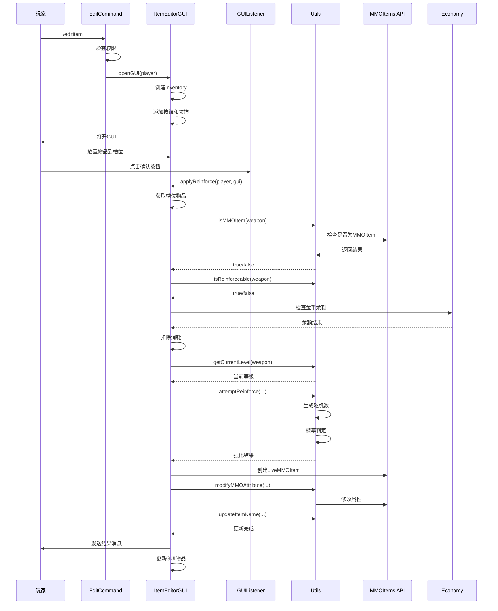
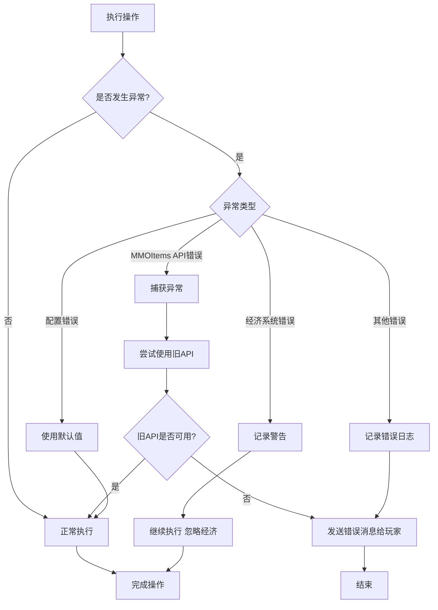

# SnowTerritory 插件逻辑流程图

本文档详细描述了 SnowTerritory 插件的完整逻辑判定流程。

## 目录

1. [插件启动流程](#1-插件启动流程)
2. [命令执行流程](#2-命令执行流程)
3. [GUI 交互流程](#3-gui-交互流程)
4. [强化判定核心流程](#4-强化判定核心流程)
5. [概率计算流程](#5-概率计算流程)

---

## 1. 插件启动流程

---

## 2. 命令执行流程

### 2.1 /edititem 命令流程

### 2.2 /reloadeditor 命令流程

---

## 3. GUI 交互流程

---

## 4. 强化判定核心流程

---

## 5. 概率计算流程

---

## 6. 属性修改流程

---

## 7. 物品验证流程

---

## 8. 完整强化流程时序图

---

## 9. 错误处理流程

---

## 关键判定点总结

### 1. 权限判定
- 玩家必须拥有 `mmoitemseditor.edit` 权限或是 OP
- 命令执行者必须是玩家（不能是控制台）

### 2. 物品判定
- 物品必须存在且不为空气
- 物品必须是有效的 MMOItems 物品
- 物品必须在可强化列表中（如果列表不为空）

### 3. 消耗判定
- Vault 金币：如果启用，必须足够
- PlayerPoints 点券：如果启用，必须足够
- 材料：必须达到配置的数量要求

### 4. 概率判定
- 成功率：根据当前等级从配置读取
- 强化符：增加 0.1 成功率
- 保护符：将失败降级概率设为 0
- 维持概率：从配置读取

### 5. 结果处理
- **成功**：属性提升，等级+1
- **失败降级**：属性降低，等级-1（有保护符则不降级）
- **维持**：属性不变，等级不变

---

## 配置影响点

1. **成功率配置**：影响 `attemptReinforce` 的判定
2. **消耗配置**：影响经济检查逻辑
3. **GUI配置**：影响界面布局和槽位
4. **可强化物品列表**：影响 `isReinforceable` 判定

---

**流程图说明**：
- 菱形：判定节点（if/else）
- 矩形：处理节点（方法调用）
- 圆角矩形：开始/结束节点
- 箭头：流程方向

